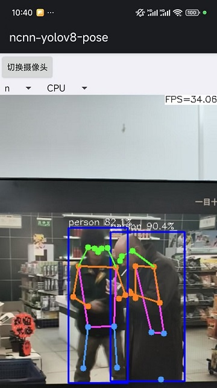

# ncnn-android-yolov8-pose

YOLOV8 attitude estimation frame rate remains stable at around 30 frames per second

## optimization

- Network architecture only `Backbone` + `Neck`
- The activation function is RELU
- FP16 reasoning

## Detailed Tutorial

I have uploaded the detailed tutorial of this project on CSDN, with the link provided：

## how to build and run
### step1
https://github.com/Tencent/ncnn/releases

* Download ncnn-YYYYMMDD-android-vulkan.zip or build ncnn for android yourself
* Extract ncnn-YYYYMMDD-android-vulkan.zip into **app/src/main/jni** and change the **ncnn_DIR** path to yours in **app/src/main/jni/CMakeLists.txt**

### step2
https://github.com/nihui/opencv-mobile

* Download opencv-mobile-XYZ-android.zip
* Extract opencv-mobile-XYZ-android.zip into **app/src/main/jni** and change the **OpenCV_DIR** path to yours in **app/src/main/jni/CMakeLists.txt**

### step3
* Open this project with Android Studio, build it and enjoy!

## some notes
* Android ndk camera is used for best efficiency
* Crash may happen on very old devices for lacking HAL3 camera interface
* All models are manually modified to accept dynamic input shape
* Most small models run slower on GPU than on CPU, this is common
* FPS may be lower in dark environment because of longer camera exposure time

## screenshot

# reference

https://github.com/FeiGeChuanShu/ncnn-android-yolov8

https://github.com/eecn/ncnn-android-yolov8-pose

https://github.com/ultralytics/ultralytics/tree/a007668e1fa8d5d586e6daa3924d65cfb139b8ac/examples/YOLOv8-NCNN-Python-Det-Pose-Cls-Seg-Obb
https://blog.csdn.net/Rachel321/article/details/130381788

https://github.com/Rachel-liuqr/yolov8s-pose-ncnn

https://zhuanlan.zhihu.com/p/622596922
